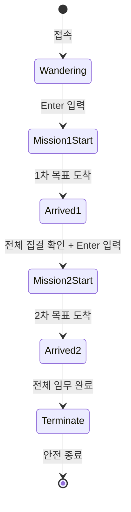

<div align="right">

🌐 <a href="./README.md">English</a>

</div>

<div align="center">

# 🛸 TCP Drone Mission Control

**TCP 소켓 기반 다중 드론 미션 제어 시뮬레이션**

멀티스레드 서버-클라이언트 구조로 다수의 드론을 동시에 제어하는 군집 비행 관제 시스템

[](#)
[](#)
[](#)
[](#)

</div>

---

## 📋 목차

- [개요](#-개요)
- [아키텍처](#️-아키텍처)
- [패킷 구조체](#-패킷-구조체-dronepacket)
- [동작 흐름](#-동작-흐름-status-기반-상태-머신)
- [핵심 구현](#-핵심-구현)
- [실행 결과](#-실행-결과-요약)
- [결론](#-결론)
- [기술 스택](#️-기술-스택)

---

## 📡 개요

| | |
|---|---|
| 🖥️ **서버** | 기지국 서버(Mission Control)가 다중 드론 클라이언트와 TCP 소켓으로 통신 |
| ⌨️ **명령 전달** | 관리자가 엔터 키를 입력하면 모든 드론에게 동시에 미션 명령 전달 (1차 → 2차 순차 진행) |
| 📏 **안전성** | 드론 간 최소 안전거리를 실시간으로 계산하여 충돌 방지 확인 |
| 🔚 **종료** | 모든 미션 완료 후 서버가 종료 신호를 보내 모든 클라이언트가 안전하게 종료 |

---

## 🗺️ 아키텍처

```
                    🛰️  기지국 서버 (Mission Control)
                              │
        ┌───────────┬─────────────┬───────────┐
        │ TCP       │ TCP         │ TCP       │ TCP
     🚁 Drone 1   🚁 Drone 2    🚁 Drone 3   🚁 Drone 4
     (배회 중)    (배회 중)     (배회 중)    (배회 중)
        │            │             │            │
        └──────── 1차 이동 명령 ──────────────────┘
                        ▼
                  📍 집결 지점
            (기지국 상공 100m, 반경 30m)
                        │
                   2차 이동 명령
                        ▼
                  🏁 최종 위치
              (왼쪽으로 50m 이동 완료)
```

각 드론이 접속하면 서버는 전용 스레드(`HandleDrone`)를 생성해 독립적인 통신 채널을 확보합니다.

---

## 📦 패킷 구조체 (`DronePacket`)

```c
typedef struct {
    int id;                     // 드론 식별 번호
    int status;                  // 0:대기, 1:1차이동, 2:1차도착, 3:2차이동, 4:2차도착, 5:종료 명령
    double x, y;                  // 현재 드론 좌표
    double targetX, targetY;      // 서버가 지정한 목표 좌표
} DronePacket;
```

---

## 🔄 동작 흐름 (Status 기반 상태 머신)

| Status | 단계 | 설명 |
|:---:|---|---|
| `0` | 🟢 Wandering | 접속 후 미션 대기, 랜덤하게 배회 |
| `1` | 🟡 Mission 1 Start | 서버가 1차 목표 좌표 전송, 드론은 즉시 이동 시작 |
| `2` | 🟦 Arrived 1 | 드론이 1차 목표 도착 후 스스로 상태 갱신 |
| `3` | 🟠 Mission 2 Start | 전 드론 도착 확인 후 2차 목표(좌측 50m)로 이동 시작 |
| `4` | 🟣 Arrived 2 | 드론이 최종 목적지에 도달 |
| `5` | 🔴 Terminate | 모든 미션 완료, 서버가 종료 패킷 송신 → 클라이언트 안전 종료 |



---

## 🧩 핵심 구현

### 🖥️ 서버 (Server)

- **다중 클라이언트 처리**: 드론이 접속할 때마다 `_beginthreadex`로 전용 스레드(`HandleDrone`) 생성
- **동시 미션 명령**: `isMissionStarted` 플래그로 모든 드론에게 일괄 미션 시작 명령 전달
- **입력 동기화**: `_kbhit()` / `_getch()`로 엔터 중복 입력 문제 해결
- **집결 체크포인트**: 모든 드론의 `status >= 2` 여부를 확인해 2차 미션 활성화 조건 판단
- **거리 측정**: 피타고라스 정리(`calcDist`)로 드론 간 거리를 계산해 최소 안전거리(10m) 유지 여부 실시간 확인

### 🚁 클라이언트 (Drone)

- **병렬 스레드 구조**: `MoveThread`(0.1초마다 0.5m씩 점진적 이동, 순간이동 방지)와 `CommThread`(0.2초마다 서버와 패킷 송수신) 분리
- **과거 데이터 방어**: `recvP.status > myDrone.status` 조건으로 오래된 패킷이 현재 상태를 덮어쓰지 않도록 보호
- **안전 종료**: `volatile int gDone` 전역 플래그로 모든 스레드가 동시에 안전하게 종료되도록 설계 (Mutex로 보호)

---

## 🎬 실행 결과 요약

```
1️⃣  서버 실행 후 드론 ID 1~4가 접속, 배회 상태로 대기
2️⃣  첫 번째 엔터 입력 → 모든 드론이 1차 목표(집결지)로 이동
3️⃣  전 드론이 집결지(반경 10m 이내) 도착 확인
4️⃣  두 번째 엔터 입력 → 모든 드론이 2차 목표(좌측 50m)로 이동
5️⃣  전 드론 최종 도착 후 서버가 종료 패킷 송신, 모든 클라이언트 정상 종료
```

---

## ✅ 결론

본 프로젝트는 TCP 소켓 기반 다중 드론 군집 비행 관제 시스템을 구현했습니다.

- 🌊 **점진적 이동**: 0.1초 주기로 0.5m씩 이동하는 부드러운 좌표 보간 로직
- 🎮 **중앙 제어 구조**: 서버의 엔터 입력 기반 명령 전달과 드론의 상태(Status) 기반 독립 동작
- 🛡️ **안전성 검증**: 피타고라스 정리를 이용한 실시간 거리 계산 및 안전거리(10m) 유지 확인

멀티스레드 기반 네트워크 프로그래밍 환경에서 실시간 데이터 처리, 동기화, 안정적인 TCP 통신 구조를 구현한 프로젝트입니다.

---

## 🛠️ 기술 스택

<div align="left">


</div>
