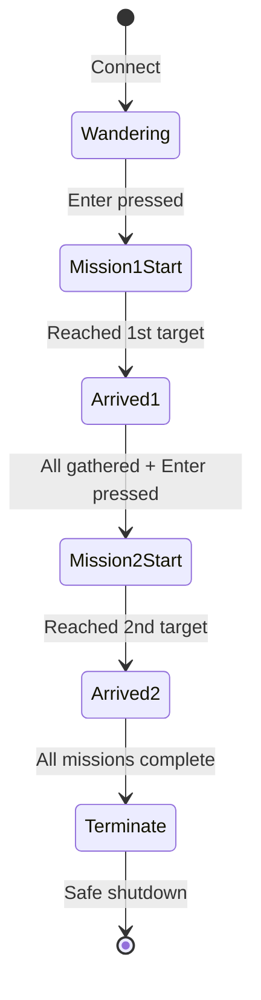

<div align="right">

🌐 <a href="./README.ko.md">한국어</a>

</div>

<div align="center">

# 🛸 TCP Drone Mission Control

**Multi-drone mission control simulation over TCP sockets**

A multithreaded server-client architecture that commands multiple drones simultaneously in a coordinated swarm mission

[](#)
[](#)
[](#)
[](#)

</div>

---

## 📋 Table of Contents

- [Overview](#-overview)
- [Architecture](#️-architecture)
- [Packet Structure](#-packet-structure-dronepacket)
- [Mission Flow](#-mission-flow-status-based-state-machine)
- [Core Implementation](#-core-implementation)
- [Execution Summary](#-execution-summary)
- [Conclusion](#-conclusion)
- [Tech Stack](#️-tech-stack)

---

## 📡 Overview

| | |
|---|---|
| 🖥️ **Server** | A ground control server (Mission Control) communicates with multiple drone clients over TCP sockets |
| ⌨️ **Command Dispatch** | A single Enter key press from the operator broadcasts the mission command to all drones at once (1st mission → 2nd mission, sequential) |
| 📏 **Safety** | Minimum distance between drones is calculated in real time to prevent collisions |
| 🔚 **Shutdown** | Once all missions are complete, the server sends a termination signal so every client can shut down safely |

---

## 🗺️ Architecture

```
                    🛰️  Ground Control Server (Mission Control)
                              │
        ┌───────────┬─────────────┬───────────┐
        │ TCP       │ TCP         │ TCP       │ TCP
     🚁 Drone 1   🚁 Drone 2    🚁 Drone 3   🚁 Drone 4
     (Wandering)  (Wandering)   (Wandering)  (Wandering)
        │            │             │            │
        └──────── 1st mission command ────────────┘
                        ▼
                  📍 Rally Point
            (100m above base, 30m radius)
                        │
                  2nd mission command
                        ▼
                  🏁 Final Position
              (Moved 50m to the left)
```

When a drone connects, the server spawns a dedicated thread (`HandleDrone`) to maintain an independent communication channel for it.

---

## 📦 Packet Structure (`DronePacket`)

```c
typedef struct {
    int id;                     // Drone identifier
    int status;                  // 0:Idle, 1:Moving1, 2:Arrived1, 3:Moving2, 4:Arrived2, 5:Terminate
    double x, y;                  // Current drone coordinates
    double targetX, targetY;      // Target coordinates assigned by the server
} DronePacket;
```

---

## 🔄 Mission Flow (Status-Based State Machine)

| Status | Stage | Description |
|:---:|---|---|
| `0` | 🟢 Wandering | Connected, waiting for mission, moving randomly |
| `1` | 🟡 Mission 1 Start | Server sends 1st target coordinates, drone starts moving immediately |
| `2` | 🟦 Arrived 1 | Drone updates its own status upon reaching the 1st target |
| `3` | 🟠 Mission 2 Start | Once all drones have arrived, the server starts the 2nd mission (move 50m left) |
| `4` | 🟣 Arrived 2 | Drone reaches its final destination |
| `5` | 🔴 Terminate | All missions complete, server sends termination packet → clients shut down safely |



---

## 🧩 Core Implementation

### 🖥️ Server

- **Multi-client handling**: Spawns a dedicated thread (`HandleDrone`) via `_beginthreadex` for every connecting drone
- **Synchronized mission dispatch**: Uses the `isMissionStarted` flag to broadcast mission-start commands to all drones at once
- **Input synchronization**: Uses `_kbhit()` / `_getch()` to prevent duplicate Enter key inputs
- **Rally checkpoint**: Checks each drone's `status >= 2` to determine whether the 2nd mission can be activated
- **Distance measurement**: Uses the Pythagorean theorem (`calcDist`) to compute inter-drone distance in real time and verify the minimum safety distance (10m) is maintained

### 🚁 Client (Drone)

- **Parallel thread design**: `MoveThread` (moves 0.5m every 0.1s for smooth interpolation, avoiding instant teleportation) is separated from `CommThread` (sends/receives packets with the server every 0.2s)
- **Stale data protection**: The condition `recvP.status > myDrone.status` prevents outdated packets from overwriting the current state
- **Safe shutdown**: A `volatile int gDone` global flag, protected by a mutex, lets all threads exit safely and simultaneously

---

## 🎬 Execution Summary

```
1️⃣  Server starts; drones with ID 1–4 connect and wait in the wandering state
2️⃣  First Enter press → all drones move toward the 1st target (rally point)
3️⃣  All drones confirmed at the rally point (within a 10m radius)
4️⃣  Second Enter press → all drones move toward the 2nd target (50m to the left)
5️⃣  All drones reach their final position; server sends termination packet; all clients shut down normally
```
---

## ✅ Conclusion

This project implements a TCP socket-based mission control system for multi-drone swarm flight.

- 🌊 **Smooth movement**: Coordinate interpolation logic that moves drones 0.5m every 0.1s
- 🎮 **Centralized control**: Server-driven, Enter-key-based command dispatch combined with independent, status-driven drone behavior
- 🛡️ **Safety verification**: Real-time distance calculation using the Pythagorean theorem to confirm the 10m minimum safety distance is maintained

The project demonstrates real-time data processing, synchronization, and a stable TCP communication structure in a multithreaded network programming environment.

---

## 🛠️ Tech Stack

<div align="left">


</div>


